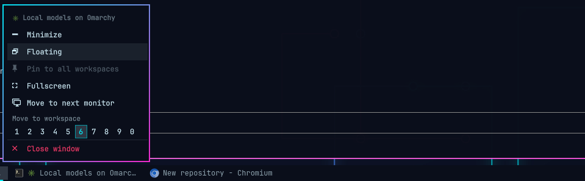

# Lanes

A workspace-first taskbar for the [Omarchy](https://omarchy.org) shell. Windows are
grouped into lanes by workspace. It runs as a native
Omarchy shell plugin (Quickshell), so it picks up your theme's colors, font,
corner rounding and bar sizing and restyles itself when you switch themes.


- **Built around workspaces.** In `monitor` or `all` scope, windows are grouped
  by workspace behind a clickable workspace chip, and the current workspace is highlighted
- **Minimize, compatible with other plugins.** Click the focused window to minimize it; it stays on the taskbar,
  dimmed, until you click it again. Uses the community `special:minimized`
  convention, so it interoperates with AppDock and minimize-aware Alt-Tab switchers
- **Agent badges.** Terminals running Claude Code show a spinner while the agent
  works and a pulsing dot when it's waiting for you, and so does their workspace chip.
  You get a notification when an agent finishes somewhere you aren't looking, and
  Ctrl+Alt+A jumps to the next one waiting
- **Top-bar widget.** A compact `✳ 2  ◐ 1  󰖰 3` summary (agents waiting, agents
  working, minimized windows; `✳ 0  ◐ 0` when idle) that opens a jump list. Or put the whole lanes strip in
  the top bar instead of a bottom bar
- **Top-edge shade.** Hover at the very top of any monitor for a slide-down
  calendar, live clock, MPRIS music controls (including Spotify), and weather
  with a live RainViewer radar map
- **Auto-hide** for the bottom bar, toggled with Ctrl+Alt+H and remembered
- **Right-click menu:** minimize, floating, pin, fullscreen, move to
  workspace 1–0, move to the next monitor, add to the Super+S scratchpad,
  or remove from it into a chosen workspace. Click outside it to dismiss
- **Keyboard:** Ctrl+Alt+1…0 acts on the Nth window, Ctrl+Alt+M opens its menu
- App icons and titles, with the focused window underlined in the theme accent
- Optional pinned launchers: focus the running app, or launch it
- Middle-click closes a window, and the scroll wheel cycles focus through the windows
- One bar per monitor. Settings live in `shell.json` and hot-reload when you save

## Install

Requires an Omarchy release with the Quickshell-based `omarchy-shell` (tested on
Omarchy 4.0.4, Quickshell 0.3.1, Hyprland 0.56 with the Lua dispatcher API).

No additional packages are required. Pinned launchers use `uwsm-app` and
`gtk-launch`; the agent helper uses `python3` and `hyprctl`; the optional weather
tab uses `curl`. These tools ship with Omarchy. Weather and radar also need
access to the services named in [Top-edge shade](#top-edge-shade).

```bash
omarchy plugin add https://github.com/DavidCBradleyJr/omarchy-lanes.git --enable
```

Enabling it adds the Lanes widget to the right of your top bar and turns on the
bottom bar. The keyboard shortcuts are optional and not installed automatically; see
[Mouse and keyboard](#mouse-and-keyboard).

Update with `omarchy plugin update davidcbradleyjr.lanes`.

## Uninstall

```bash
omarchy plugin remove davidcbradleyjr.lanes
```

If you set up the keyboard shortcuts, also delete the `pcall(require, "hypr.lanes")`
line from `~/.config/hypr/hyprland.lua` and remove `~/.config/hypr/lanes.lua`.

Installation does not edit your configuration files. At runtime Lanes writes
minimize records to `$XDG_RUNTIME_DIR/hyprland-minimizer/` and an agent snapshot
to `$XDG_RUNTIME_DIR/omarchy-lanes/` (both temporary). Changing Lanes settings
through the shell updates its own entry in `~/.config/omarchy/shell.json`.

## Configure

Settings are inline on the plugin's entry in `~/.config/omarchy/shell.json`, which
lives in the bar layout alongside the widget (installs from before v0.3 keep it in
`plugins[]`; both work). The bottom bar and the widget share the one entry. Every
key is optional, and the Setup panel offers a form for them:

```json
"right": [
  {
    "id": "davidcbradleyjr.lanes",
    "mode": "summary",
    "bottomBar": "show",
    "autoHide": false,
    "shade": true,
    "shadeHeight": 480,
    "agents": true,
    "agentNotify": true,
    "position": "bottom",
    "scope": "workspace",
    "align": "left",
    "showTitles": true,
    "groupByWorkspace": true,
    "clickToMinimize": true,
    "maxButtonWidth": 220,
    "transparent": false,
    "pinned": ["chromium", "org.gnome.Nautilus"]
  }
]
```

| Key | Values | Default | |
|---|---|---|---|
| `mode` | `summary`, `lanes` | `summary` | Top-bar widget: counters with a jump list, or the whole strip inline |
| `bottomBar` | `show`, `off` | `show` (`off` in lanes mode) | The bottom bar |
| `autoHide` | bool | `false` | Slide the bottom bar away until the pointer reaches the edge. Ctrl+Alt+H toggles it |
| `shade` | bool | `true` | Hover at the top edge for the calendar, clock, music, and weather shade |
| `shadeHeight` | 320–720 px | `480` | Open height of the top-edge shade |
| `agents` | bool | `true` | Agent badges and counters |
| `agentNotify` | bool | `true` | Notify when an agent finishes while you're looking elsewhere |
| `agentWorkingPattern`, `agentWaitingPattern` | regex string | – | Extra title patterns for other agents |
| `centerReserve` | px | `260` | Lanes mode: room kept free on each side of the top bar's center |
| `position` | `bottom`, `top` | `bottom` | Screen edge. If you choose `top`, move the Omarchy bar to the bottom |
| `scope` | `workspace`, `monitor`, `all` | `workspace` | Which windows each monitor's taskbar lists |
| `align` | `left`, `center`, `right` | `left` | Where the buttons sit |
| `showTitles` | bool | `true` | Set to `false` for an icon-only dock strip |
| `groupByWorkspace` | bool | `true` | Sort by workspace with a chip per group (when `scope` isn't `workspace`) |
| `clickToMinimize` | bool | `true` | Clicking the focused window minimizes it |
| `maxButtonWidth` | number ≥ 40 | `220` | Longer titles are truncated |
| `transparent` | bool | `false` | No background behind the strip |
| `pinned` | desktop entry ids | `[]` | Launchers, e.g. `firefox`, `org.gnome.Nautilus` |

Scratchpad windows stay listed on their monitor in every scope. Right-click
one, choose **Remove from scratchpad**, then pick workspace 1–0. Minimized
windows show on the taskbar of the workspace they were minimized from.

## Mouse and keyboard



| | |
|---|---|
| Left-click | Focus the window. If it's already focused, minimize it. If it's minimized, restore it |
| Middle-click | Close the window |
| Right-click | Window menu |
| Scroll wheel | Cycle focus through the listed windows |
| Click a workspace chip | Switch to that workspace |
| Ctrl+Alt+1 … 9, 0 | Same as left-clicking the Nth window on the focused monitor |
| Ctrl+Alt+M | Toggle the window menu for the focused window |
| Ctrl+Alt+A | Jump to the next agent waiting for you |
| Ctrl+Alt+H | Toggle bottom-bar auto-hide (saved) |
| Ctrl+Alt+B | Show / hide the taskbar |

Omarchy already uses Super+number for workspaces, so the taskbar uses Ctrl+Alt.
The bindings are in [`hypr/lanes.lua`](hypr/lanes.lua):

```bash
ln -s ~/.config/omarchy/plugins/davidcbradleyjr.lanes/hypr/lanes.lua ~/.config/hypr/lanes.lua
# then in ~/.config/hypr/hyprland.lua, after require("hypr.bindings"):
#   pcall(require, "hypr.lanes")
```

Keyboard layouts where AltGr acts as Ctrl+Alt (German, Polish, …) use AltGr+digits for
characters. On those, edit the modifier in `lanes.lua`.

## Agents

Lanes tracks coding agents from two sources:

- **Window titles.** Claude Code writes its state into the terminal title: `✳ …`
  while it waits for input, a spinning `◐◓◑◒ …` while it works. This works instantly,
  in any terminal, with no setup.
- **Session logs.** A small helper, [`bin/lanes-agents`](bin/lanes-agents), reads the
  ends of the Codex and Claude Code session logs every few seconds. It finds the model,
  the task title, what the agent is doing right now, and which window it runs in.
  It's also how Lanes sees the **Codex app**, whose window title never changes.

| Agent | Log it reads | What you get |
|---|---|---|
| Codex app and Codex CLI | `~/.codex/sessions/**/rollout-*.jsonl`, `~/.codex/session_index.jsonl` | working / finished, model, thread name, current step, and a `codex://threads/…` link that reopens the thread |
| Claude Code | `~/.claude/projects/<dir>/<session>.jsonl` | model, session title, last tool or reply |

The helper only reads; it never writes to an agent's files. It writes its snapshot to
`$XDG_RUNTIME_DIR/omarchy-lanes/agents.json` and stops when the shell exits. It needs
`python3`, which Omarchy already depends on. Test it with `bin/lanes-agents --once`.

On the taskbar:

- A **spinner** on a window's icon means an agent there is working. A **pulsing dot**
  means one is waiting for you. The workspace chip gets a dot too, so you can see
  "workspace 6 needs me" without looking at the windows
- When an agent finishes and you aren't looking at its window, you get a desktop
  notification
- In the top bar, `✳` counts agents waiting for you and `◐` counts agents working.
  Click either one for a list showing each agent's app, model, task and current step.
  Click a row to jump there: the Codex app opens that exact thread, and a terminal
  gets focus (restored first if it was minimized). Ctrl+Alt+A cycles through
  waiting agents

A Codex turn counts as "waiting" for 15 minutes after it finishes, then drops off the
counters.

For agents that mark their titles differently, add patterns, e.g.
`"agentWaitingPattern": "^\\[waiting\\]"`.

## Top bar

The widget sits next to Omarchy's own **Agents** widget: that one covers plan usage and
limits, and Lanes covers what your agents are doing right now. In `summary` mode the
agent counters are always shown (dimmed `0` when nothing's running); the minimized
counter appears only when a window is minimized.

`"mode": "lanes"` moves the whole strip into the top bar and turns the bottom bar off
(set `"bottomBar": "show"` to keep both). The Omarchy bar doesn't share out space
between its sections, so the strip measures the room up to the bar's center and drops
to icons only when titles won't fit. It has the most room in the left section:

```bash
omarchy bar move davidcbradleyjr.lanes --section left
```

## Top-edge shade

Move the pointer to the top 3 pixels of a monitor and pause briefly. The shade
slides down and remains open while the pointer is inside it; move away to dismiss
it, or click the handle at the bottom. The four tabs are:

| Tab | Content |
|---|---|
| Calendar | Locale-aware month grid with month navigation and a Today button |
| Clock | Live digital and analog local clock |
| Music | The active MPRIS player, album art, seek bar, transport controls, and source switching; Spotify works through its standard MPRIS interface |
| Weather | Current conditions, five-day forecast, and precipitation radar centered on the Omarchy weather location, with zoom and a ten-frame timelapse |

Weather uses the location configured in Omarchy's weather panel. If none is set,
it uses the same IP-based `wttr.in` lookup as Omarchy. Forecast data comes from
Open-Meteo; the map uses Esri dark canvas tiles and RainViewer radar tiles. Use
the `+`/`-` controls or the mouse wheel to zoom through RainViewer's supported
levels 4-7. The ten recent radar frames preload before the timeline's playback
control becomes available, keeping the animation smooth once it starts.

## Minimize convention

Minimized windows are moved to `special:minimized`, and their origin is recorded in
`$XDG_RUNTIME_DIR/hyprland-minimizer/state.json` (plus a newest-first
`history.txt`). This is the same format [AppDock](https://github.com/gdeyoung/omarchy-appdock)
uses, so windows minimized by either tool can be restored by the other.

## IPC

```bash
omarchy-shell shell call davidcbradleyjr.lanes focusIndex 3
omarchy-shell shell call davidcbradleyjr.lanes menu ""
omarchy-shell shell call davidcbradleyjr.lanes nextAgent ""
omarchy-shell shell call davidcbradleyjr.lanes agents working   # or waiting, minimized
omarchy-shell shell call davidcbradleyjr.lanes showShade 3      # weather tab
omarchy-shell shell call davidcbradleyjr.lanes hideShade ""
omarchy-shell shell call davidcbradleyjr.lanes toggleShade 0
omarchy-shell shell call davidcbradleyjr.lanes toggleAutoHide ""
omarchy-shell shell call davidcbradleyjr.lanes toggleVisible ""
```

## Develop

Work from your own checkout of this repository, linked in as the plugin:

```bash
ln -s /path/to/your/checkout ~/.config/omarchy/plugins/davidcbradleyjr.lanes
omarchy-shell shell rescanPlugins
omarchy plugin enable davidcbradleyjr.lanes
node tests/model.test.js    # pure logic in TaskbarModel.js
python3 tests/test_agents.py  # the agent helper
```

After editing an already-loaded plugin, run `omarchy restart shell`. The shell's
hot-reload rescans plugins but doesn't clear Qt's component cache, so QML files that
were already loaded keep their old code. Shell logs:
`journalctl --user -f | grep omarchy-shell`.

| File | Role |
|---|---|
| `manifest.json` | Plugin manifest (`panel` + `bar-widget`, settings schema) |
| `Taskbar.qml` | Bottom bar: per-monitor windows, auto-hide, IPC |
| `BarWidget.qml` | Top-bar widget: summary counters and popup, or inline lanes |
| `TopShade.qml` | Per-monitor hover shade and tab navigation |
| `ShadeCalendar.qml`, `ShadeClock.qml`, `ShadeMedia.qml`, `ShadeWeather.qml` | Shade views |
| `Actions.qml` | Shared core: settings, window list, agents, minimize, actions |
| `LaneStrip.qml` | The lanes strip, used by the bottom bar and inline mode |
| `bin/lanes-agents` | Agent helper: Codex / Claude Code sessions from their logs |
| `TaskButton.qml` | A single themed button |
| `WorkspaceChip.qml` | Workspace group label |
| `ContextMenu.qml` | Right-click menu (built on Omarchy's `PopupCard`) |
| `hypr/lanes.lua` | Keybindings |
| `TaskbarModel.js` | Pure logic: settings, filtering, grouping, minimize records, dispatch strings |

## License

MIT
